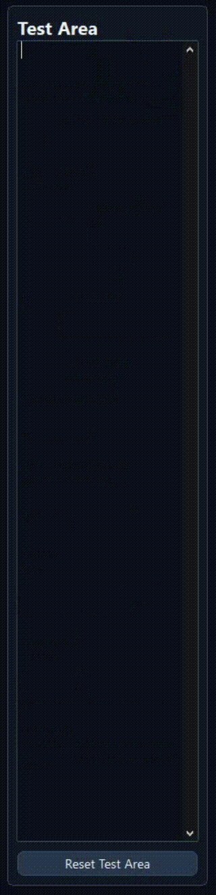
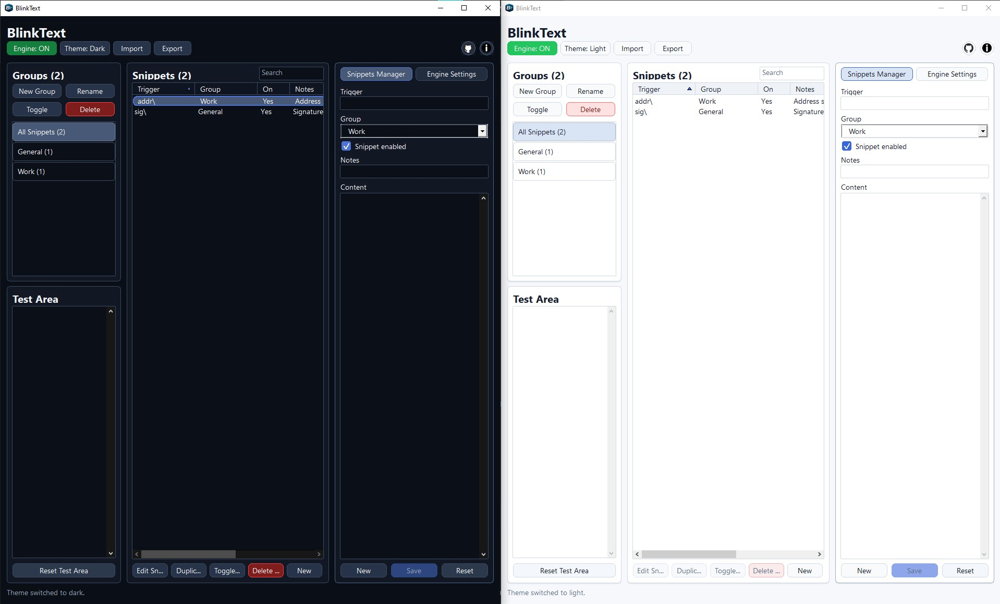

# BlinkText

BlinkText is a fast, local text expansion tool for Windows.

It is built for instant typing workflows, reusable snippets, writing shortcuts, clipboard-aware expansions, and dynamic variables while staying fully offline, lightweight, and practical for everyday use.

## Download

Downloads are published through GitHub Releases:

- [Latest Release](https://github.com/LeaDer-E/BlinkText/releases/latest)
- [All Releases](https://github.com/LeaDer-E/BlinkText/releases)

Available release formats:

- Portable
- Installer

Typical release assets:

- `BlinkText_Portable_v1.1.0.zip`
- `BlinkText_Setup_v1.1.0.exe`

## Demo

This section is reserved for a short GIF demo of BlinkText in action.

Suggested future file:

- `docs/media/blinktext-demo.gif`

Example placeholder:

```md

```

## Screenshot

This section is reserved for the main BlinkText interface screenshot.

Suggested future file:

- `docs/media/blinktext-ui.png`

Example placeholder:

```md

```

## Why BlinkText

BlinkText focuses on speed, reliability, and local control.

It is designed to:

- expand triggers instantly
- stay fully offline
- avoid paste conflicts as much as possible
- remain responsive during normal typing
- support clipboard-aware actions
- support dynamic variables inside snippets
- support migration from compatible tools such as Beeftext

## Main Features

- Fast snippet expansion outside the app
- Built-in `Test Area`
- Group-based snippet organization
- Snippet enable and disable support
- Trigger notes and preview
- Light mode and dark mode
- Tray icon support
- Start with Windows
- Always on top
- Minimize to tray
- Global hotkey recording
- Native BlinkText JSON import and export
- Beeftext combos JSON import and export
- Clipboard helper triggers:
  - `\\`
  - `//`
- Dynamic variables inside snippet content
- Safe local saving with backup behavior
- Themed context menus, dialogs, and editor tools

## What BlinkText Does

BlinkText lets you type short triggers such as:

- `sig\`
- `addr\`
- `sum\`
- `tr1\`

and expand them into larger text instantly.

Typical use cases:

- email signatures
- job application templates
- translation prompts
- writing blocks
- reusable professional summaries
- AI prompts
- repeated business text

## Variables

BlinkText supports dynamic variables inside snippet content.

Examples:

```text
#{clipboard}
#{previousClipboard}
#{date}
#{time}
#{dateTime:yyyy-MM-dd HH:mm:ss}
#{input:}
#{key:Tab}
#{shortcut:Ctrl+Shift+S}
#{delay:1000}
#{cursor}
#{combo:trigger}
#{trim:trigger}
#{upper:trigger}
#{lower:trigger}
#{envVar:USERNAME}
#{powershell:C:\Temp\script.ps1}
```

Full documentation:

- [VARIABLES.md](./VARIABLES.md)
- [Wiki / Variables](./Wiki/VARIABLES.md)

## Application Layout

BlinkText is organized into these main areas.

### Top Bar

Contains:

- `Engine ON/OFF`
- `Theme`
- `Import`
- `Export`
- `GitHub`
- `Info`

### Groups

Used to organize snippets into groups.

Actions:

- `New Group`
- `Rename`
- `Toggle`
- `Delete`

### Test Area

A built-in sandbox for testing triggers without leaving the app.

Useful for:

- testing imports
- checking trigger behavior
- checking separator mode
- checking variable expansions

### Snippets

The main snippet list contains:

- `Trigger`
- `Group`
- `On`
- `Notes`
- `Preview`

Actions include:

- select snippet
- search
- sort
- duplicate
- delete
- toggle snippet state
- edit selected snippet
- create new snippet

### Snippets Manager

The right panel contains:

- `Snippets Manager`
- `Engine Settings`

#### Snippets Manager

Used to edit:

- trigger
- group
- enabled state
- notes
- content

Buttons:

- `New`
- `Save`
- `Reset`

#### Engine Settings

Contains:

- `Restore clipboard (ms)`
- global hotkey display
- `Record Hotkey`
- `Always on top`
- `Start with Windows`
- `Minimize to tray`
- `Use \\ for previous clipboard item`
- `Use // for previous clipboard item`
- `Case sensitive matching`
- trigger mode
- separator keys
- `Save Settings`
- `Reset Settings`

## Trigger Modes

BlinkText supports two trigger modes:

### Instant

The snippet expands as soon as the trigger is completed.

### Separator

The snippet expands only after a separator key is pressed.

Supported separator keys:

- `Space`
- `Enter`
- `Tab`

More details:

- [Wiki / Trigger Modes](./Wiki/Trigger%20Modes.md)

## Clipboard Features

BlinkText supports:

- `#{clipboard}`
- `#{previousClipboard}`
- built-in clipboard helper triggers:
  - `\\`
  - `//`

Clipboard behavior is designed to stay stable during one expansion by using a snapshot captured at the start of that expansion.

More details:

- [Wiki / Clipboard Features](./Wiki/Clipboard%20Features.md)

## Import and Export

Supported import formats:

- Native BlinkText JSON
- Beeftext combos JSON

Supported export formats:

- Native BlinkText JSON
- Beeftext combos JSON

Import supports:

- file selection
- browse to another file
- keep source groups
- import into a chosen group
- skip conflicts
- overwrite conflicts

Export supports:

- all snippets
- current group only

Default export location:

- Windows `Documents`

Suggested export names:

- `BlinkText-D-M-Y-H-M.json`
- `BlinkText-BeefText-D-M-Y-H-M.json`

More details:

- [Wiki / Import and Export](./Wiki/Import%20and%20Export.md)

## Context Menus

BlinkText uses app-themed context menus that adapt to:

- dark mode
- light mode

Supported edit actions include:

- Undo
- Cut
- Copy
- Paste
- Delete
- Select All
- Right to left Reading order
- Show Unicode control characters
- Insert Unicode control character
- Open IME
- Reconversion

## Tray Behavior

BlinkText keeps a tray icon visible while the app is running.

Tray behavior includes:

- always-visible tray icon
- minimize to tray
- restore from tray
- paused tray icon support
- tray menu actions

If the engine is paused, BlinkText can use:

- `app_pause.ico`

The normal way to exit BlinkText completely is through the tray `Quit` action.

## Global Hotkey

Default global toggle hotkey:

- `Ctrl + Shift + F12`

You can change it directly from the UI using:

- `Record Hotkey`

## Compatibility with Beeftext

BlinkText is designed to be migration-friendly for Beeftext users.

It supports:

- importing Beeftext combos exports
- many familiar variable styles
- similar text-expansion workflows

BlinkText also adds features that Beeftext does not expose in the same way, such as:

- `#{previousClipboard}`
- `#{key:...}`
- `#{shortcut:...}`
- `#{delay:...}`
- `#{trim:...}`

More details:

- [Wiki / Compatibility with Beeftext](./Wiki/Compatibility%20with%20Beeftext.md)

## About

The built-in `Info` dialog currently presents:

```text
BlinkText v1.0
Fast, local text expansion tool designed for instant, reliable typing with zero delay.

Key Features
- Instant expansion without paste conflicts
- No trigger duplication during rapid input (e.g. Ctrl+V after trigger)
- Fully offline - no data collection
- Lightweight and optimized for speed
- Supports importing exported triggers from compatible tools

Compatibility
- Supports importing exported triggers from Beeftext for seamless migration

Privacy
- No user data is collected, stored, or transmitted

Developer
- Developed by: Eslam Mustafa
- Contact: Eslam.Youssef@protonmail.com / Eslam.G.Youssef@gmail.com
- GitHub: https://github.com/LeaDer-E
```

## Build From Source

### CMake

The project root already contains:

- `CMakeLists.txt`

If you prefer a CMake-based workflow, start from there.

### Portable Build

The easiest portable build path:

```bat
01 - build_portable.bat
```

### Installer Build

The Inno Setup installer script:

```text
02 - BlinkText_Installer.iss
```

Compile it with Inno Setup Compiler after building the release files.

### Packaging Notes

A short packaging guide is available here:

- [PACKAGING_README.md](./PACKAGING_README.md)

### Manual MinGW Build Example

```powershell
windres src\BlinkText.rc -O coff -o build\resource.o
g++ -std=c++17 -O2 -Wall -Wextra `
  -DUNICODE -D_UNICODE -DWIN32_LEAN_AND_MEAN -DNOMINMAX `
  src\main.cpp src\AppWindow.cpp src\SimpleJson.cpp build\resource.o `
  -o build\BlinkText.exe `
  -mwindows `
  -luser32 -lgdi32 -lcomdlg32 -lshell32 -lcomctl32 `
  -luxtheme -ldwmapi -lole32 -luuid -lgdiplus -limm32
```

## Documentation and Wiki

Project documentation currently includes:

- [README.md](./README.md)
- [VARIABLES.md](./VARIABLES.md)
- [Wiki / Home](./Wiki/Home.md)
- [Wiki / Variables](./Wiki/VARIABLES.md)
- [Wiki / Import and Export](./Wiki/Import%20and%20Export.md)
- [Wiki / Trigger Modes](./Wiki/Trigger%20Modes.md)
- [Wiki / Clipboard Features](./Wiki/Clipboard%20Features.md)
- [Wiki / Compatibility with Beeftext](./Wiki/Compatibility%20with%20Beeftext.md)
- [Wiki / Building BlinkText](./Wiki/Building%20BlinkText.md)
- [Wiki / FAQ](./Wiki/FAQ.md)

## Privacy

BlinkText is fully offline.

It does not:

- collect user data
- upload snippet content
- transmit clipboard content
- require login or cloud sync

## Assets

Application assets are stored in:

```text
src\assets
```

Important files:

- `app.ico`
- `app_pause.ico`
- `github.png`
- `info.png`
- `icon.png`

## Project Structure

```text
BlinkText/
  01 - build_portable.bat
  02 - BlinkText_Installer.iss
  CMakeLists.txt
  PACKAGING_README.md
  README.md
  VARIABLES.md
  WIKI_HOME.md
  Wiki/
    Home.md
    VARIABLES.md
    Import and Export.md
    Trigger Modes.md
    Clipboard Features.md
    Compatibility with Beeftext.md
    Building BlinkText.md
    FAQ.md
    _Sidebar.md
  src/
    assets/
      app.ico
      app_pause.ico
      github.png
      info.png
      icon.png
    AppWindow.cpp
    AppWindow.h
    BlinkText.rc
    main.cpp
    resource.h
    SimpleJson.cpp
    SimpleJson.h
  python/
    BlinkText.py
    requirements.txt
```

## Developer

- Developed by: Eslam Mustafa
- Contact: Eslam.Youssef@protonmail.com
- Contact: Eslam.G.Youssef@gmail.com
- GitHub: https://github.com/LeaDer-E

## Notes

- BlinkText is designed to stay local-first, lightweight, and responsive.
- The release section is intended to contain both Portable and Installer builds.
- The Demo and Screenshot sections are already reserved so you can add your GIF and UI image later without restructuring the README.
